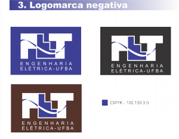
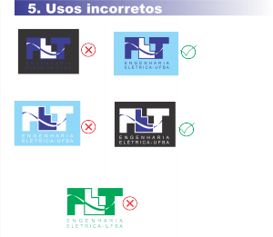
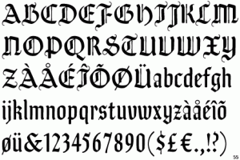
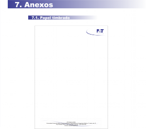

Pense rapidamente na sua marca de refrigerante preferido, naquele navegador de internet que você mais usa, na série de TV que você mais assiste, nas redes de _fast food_ mais famosas que você conhece, ou mesmo no site de busca que você mais acessa (esse foi o Google, não?).

Em todos os elementos comerciais que você pensou, certamente lhe veio à cabeça, dentre outras coisas, as suas respectivas logomarcas. Por exemplo, caso o seu refrigerante preferido tenha sido a Coca-Cola, a imagem do seu nome (escrito em letras brancas de fonte bem característica e fundo vermelho) lhe veio à mente. E essa logomarca é tão marcante que você a reconheceria mesmo que nela estivesse escrito outra coisa que não “Coca-Cola”. Recurso visual poderoso, não?

]

O exemplo acima ilustra a importância de se criar uma **identidade visual** em uma entidade que necessita zelar por sua imagem e captar público, seja ela uma empresa, um órgão governamental ou uma instituição sem fins lucrativos. A palavra **identidade**, embora abarque diferentes definições, pode ser entendida de uma forma geral como um conjunto de características próprias que definem cada coisa, como seres e objetos, de forma específica.Tome como exemplo uma identidade matemática, que é usualmente definida como uma igualdade que permanece a mesma, não importando os valores das variáveis que nela aparecem. Uma logomarca, então, para que possua uma identidade, deve buscar sempre possuir as características próprias que a define, não importa se ela aparece em tamanho grande ou pequeno, em fundo escuro ou claro e se está em um convite de festa ou em um documento formal.

Mas, afinal, como definir a identidade de uma marca? Quais características a define? Quais delas devem permanecer imutáveis e quais as que possuem flexibilidade? Como utilizar corretamente essa marca de forma a manter a sua identidade?

Para esclarecer esses pontos e formalizar um estudo sobre a utilização adequada de uma marca é que uma entidade cria o seu **manual da marca**. Em poucas palavras, um manual da marca é um documento que contém todas as regras e padronizações acerca de uma marca, bem como ilustrações de como usá-la (e como não usá-la). Assim, caso você, por exemplo, queira contratar um serviço gráfico terceirizado para sua empresa e necessite que sua marca apareça (seja em cartaz, banner, comercial ou o que for), a prestadora do serviço poderá saber como usar adequadamente sua marca apenas consultando o seu manual. Simples assim.

Agora, neste ponto de nosso texto, pode surgir outra questão: como se confeccionar um manual da marca? Esta resposta depende bastante do grau de detalhe que você deseja empregar no estudo da sua marca, o que pode fazer com que seu manual vá de algo simples a uma verdadeira tese. Mas vamos com calma. A seguir estão listados alguns passos gerais para que você possa dar o ponto de partida na confecção do seu manual:

- **Encontre a identidade de sua organização:** Essa etapa pode parecer redundante, mas na verdade é a fundamental. Todo o estudo acerca da sua marca apenas terá sentido quando você descobrir o que quer expressar com ela, e isso irá guiar a sua utilização de cores, tipografia, dimensões máxima e mínima, usos incorretos, etc.

Uma maneira possível de se descobrir essa identidade é listando uma série de perguntas que podem guiar a sua percepção sobre ela, como: o que ela deve representar? Qual a impressão que a marca deve passar a quem a observa? Quais cores transmitem essas impressões? Em quais meios ela será mostrada e como se adequar a esses meios? Caso você esteja trabalhando em grupo, práticas como rodas de discussão e _brainstomings_ também podem ser uma boa saída.

- **Defina uma logomarca que esteja de acordo com as suas percepções:** após fazer todas as perguntas adequadas e obter suas percepções, chegou a hora de colocar tudo no papel (mesmo que em papel digital). A criação de uma logomarca em geral não é tarefa das mais simples, pois depende em parte de habilidades intuitivas e de sua experiência com design gráfico. Uma boa prática para confeccioná-la é observar logomarcas que você considera boas e procurar extrair delas a idéia por trás. Mas, atenção! Isso não significa que você deva copiar outras logomarcas. Procure ser criativo e colocar suas características na sua marca.

Quando a logomarca aparecer no manual, ela deve vir com uma indicação sobre quais as situações na qual ela ser utilizada. É recomendável também que se coloque, se possível, o código de cores ([CMYK](http://pt.wikipedia.org/wiki/CMYK) e [RGB](http://pt.wikipedia.org/wiki/RGB) são os mais comuns) das principais cores utilizadas, para evitar possíveis erros de descaracterização.

Na análise de cores que você fizer para compor sua logomarca, existem estudos psicológicos sobre efeitos das cores no ser humano que podem ser de grande ajuda. Para saber mais sobre esses significados psicológicos, seguem abaixo alguns links que podem ajudar:

\- [http://www.slideshare.net/sergioborgato/a-utilizao-das-cores-na-comunicao-visual](http://www.slideshare.net/sergioborgato/a-utilizao-das-cores-na-comunicao-visual)

\- [http://www.lsc.ufsc.br/~edla/design/cores2.htm](http://www.lsc.ufsc.br/~edla/design/cores2.htm)

\- [http://darlanglauber.wordpress.com/2007/05/16/significado-das-cores/](http://darlanglauber.wordpress.com/2007/05/16/significado-das-cores/)

- **Estude os tipos de utilização da sua marca:** a marca da sua organização, em geral, necessita possuir algumas regras básicas de utilização para evitar perda de identidade. Porém, essas regras também devem servir para que sua marca seja melhor visualizada por seus clientes. Um exemplo bem comum é a definição de uma versão negativa para a logomarca, que nada mais é do que a sua logomarca com uma inversão de suas cores básicas (em muitos casos, apenas a inversão de sua cor de fundo ou de contorno). A principal utilidade da versão negativa é a adequação da logo a fundos claros e escuros, evitando-se perda de contraste visual.

No caso da logomarca do PET-Elétrica da UFBA, que é escura em sua versão original, a negativa é aplicada em fundos escuros para manter um razoável contraste (e, portanto, uma fácil visibilidade).

No caso de muitas marcas, a logo contém alguma frase auxiliar em conjunto com o seu símbolo (por exemplo, “ENGENHARIA ELÉTRICA – UFBA”). Assim sendo, faz-se necessário por vezes criar uma padronização de utilização do símbolo em si, separado desta frase, para as ocasiões em que a frase aparecer de outra maneira, como ao lado do símbolo.

Uma prática também bastante comum em manuais da marca é a listagem de usos incorretos do símbolo e da logo.  Os critérios utilizados para definir essas regras são justamente as vias de preservação da sua identidade visual, e portanto tais usos incorretos indicam práticas que prejudicam essa identidade. (Imagine se, por exemplo, você um dia visse a logomarca do McDonalds na cor verde. Não seria estranho?).

- **Defina uma família tipográfica para sua marca:** para aqueles que não estão familiarizados com o conceito, a palavra tipografia é hoje usada com um significado quase indistinto de tipologia, sendo definida como “a arte e o processo de criação na composição de um texto, física ou digitalmente” ([http://pt.wikipedia.org/wiki/Tipografia](http://pt.wikipedia.org/wiki/Tipografia)). O termo “tipo” (do grego _typos_, forma) pode ser entendido como a arte ou o desenho de uma determinada família de caracteres, como Arial ou Verdana. Uma explicação profunda do que venha a ser tipografia, bem como o estudo de sua utilização, está muito além do objetivo deste texto. Assim, para aqueles que se interessarem pelo assunto, segue abaixo alguns links para consulta:

\- [http://design.blog.br/design-grafico/o-que-e-tipografia](http://design.blog.br/design-grafico/o-que-e-tipografia)

\- [http://www.revistaleaf.com.br/definicoes-de-tipografia/831/](http://www.revistaleaf.com.br/definicoes-de-tipografia/831/)

\- [http://www.slideshare.net/loammisantos/tipografia-6329925](http://www.slideshare.net/loammisantos/tipografia-6329925)

A tipografia, mais do que simplesmente definir uma padronização de caracteres em uma determinada família, define características associadas a eles que, assim como as cores, trazem uma idéia a ser transmitida visualmente. E é justamente aí que entra a importância da definição tipográfica para a sua identidade visual: transmitir uma idéia através da própria forma da escrita.

Na elaboração de um manual da marca, deve-se primeiramente definir (caso haja) a fonte com a qual foram escritos os nomes na logomarca. Fontes próprias, ou seja, criadas pelo autor da logomarca, não precisam ser definidas, ficando isso a critério dele. Em seguida, define-se a família de fontes a ser utilizada na escrita de textos oficiais que vierem acompanhando a logo (como, por exemplo, em ofícios ou contratos), apresentando-se para ela as restrições adequadas (por exemplo, uma variação em negrito não é usada em textos corridos, e por aí vai).

- **Inclua os anexos apropriados:** caso algo a mais já tenha sido criado com a sua logomarca ou tendo uma ligação com ela, é recomendado que isso seja incluído no seu manual da marca. No Manual da Marca do PET-Elétrica, por exemplo, foram incluídos o modelo de papel timbrado e de _template_ de slides usados pelo grupo. No manual da Identidade Visual da UFBA, que trata principalmente do brasão da universidade, foram incluídos como anexo os brasões de suas subunidades (Escola Politécnica, Faculdade de Medicina, Instituto de Física...).

Agora que você já adquiriu uma noção básica sobre pontos a serem incluídos no seu manual da marca, é hora de praticar. O primeiro passo para ganhar confiança na confecção do seu manual é observar outros manuais para ter uma referência. Recomendamos alguns que foram de grande ajuda:

\- Manual de Uso da Marca Dako: [http://www.dako.com.br/empresa/comunicacao/manual\_marca/pdf/dako\_manual.pdf](http://www.dako.com.br/empresa/comunicacao/manual_marca/pdf/dako_manual.pdf)

\- Manual de Identidade Visual FIAT: [http://www.logotypes101.com/guidelines/fiat\_\_in\_portuguese\_.pdf](http://www.logotypes101.com/guidelines/fiat__in_portuguese_.pdf)

\- Manual de Identidade Visual - Universidade Federal da Bahia: [https://www.ufba.br/manual-de-identidade-visual](https://www.ufba.br/manual-de-identidade-visual)

\- Manual de Aplicação de Identidade Visual Ecoforest: [http://www.cesumar.br/comunicacao/arquivos/ecoforest.pdf](http://www.cesumar.br/comunicacao/arquivos/ecoforest.pdf)

E, claro, não deixe de conferir o Manual da Marca do PET-Elétrica UFBA, disponível agora em nossa sessão de downloads

[http://www.peteletrica.eng.ufba.br/?page\_id=229](http://www.peteletrica.eng.ufba.br/?page_id=229)

**Referências:**

\- Como confeccionar o seu manual da marca

\- [http://www.slideshare.net/hdneves/manual-de-identidade-idias-para-se-fazer-um](http://www.slideshare.net/hdneves/manual-de-identidade-idias-para-se-fazer-um)

\- [http://www.oficinadanet.com.br/artigo/2259/como\_criar\_um\_manual\_de\_identidade\_visual](http://www.oficinadanet.com.br/artigo/2259/como_criar_um_manual_de_identidade_visual)

\- [http://logotomia.com.br/crie/criando-um-manual-de-identidade-visual/](http://logotomia.com.br/crie/criando-um-manual-de-identidade-visual/)
